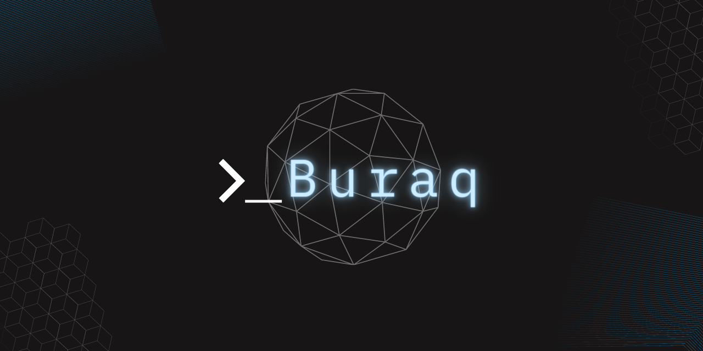

[](https://svgshare.com/i/Zhy.svg)&nbsp;&nbsp;&nbsp;&nbsp;
[](https://github.com/gomods/athens)&nbsp;&nbsp;&nbsp;&nbsp;
[](http://perso.crans.org/besson/LICENSE.html)&nbsp;&nbsp;&nbsp;&nbsp;

# buraq

A command-line based utility for bruteforcing ssh

# Contents

- [Installation](#installation)
- [Setup & Uninstallation](#setup-&-uninstallation)
- [Usage](#usage)
- [Warning](#warning)
- [License](#license)
- [Credits](#credits)

# Installation :floppy_disk:

To install `buraq`, clone the repository at the desired location:

```console
$ git clone https://github.com/NovusEdge/buraq.git
```

# Setup & Uninstallation :bulb:

After cloning the repository to your machine, navigate to it and run the `setup` script.

```console
$ cd buraq

$ # Run the setup script:
$ bash setup.bash
```

***NOTE***: `buraq` is not added to `$PATH` by the setup script. If you wish to add it to your `PATH`, add the following line to your `~/.profile` or `~/.bashrc` files **after running the setup script**.

```bash
PATH=$PATH:$(cat $HOME/.buraq/env | grep BURAQBIN | awk -F'=' '{print $2}') >> ~/.profile
```

Alternatively, if you don't want to add it to `PATH`, you can simply type in:

```console
$ export PATH=$PATH:$(cat $HOME/.buraq/env | grep BURAQBIN | awk -F'=' '{print $2}')
```

# Usage :rocket:

To display help/usage information for `buraq`, use `buraq help`:

```console
$buraq help
buraq v1.0.0 (c) 2022 by Aliasgar Khimani (NovusEdge) - Please do not use in military or secret service organizations, or for illegal purposes (this is non-binding, these *** ignore laws and ethics anyway).

Buraq:
    A command-line utility for bruteforcing ssh

USAGE:
    buraq [command] [options] target

COMMANDS:
    help                Prints this menu if no further option is provided. This
                        can be used in conjunction with other command names to
                        print a more comprehensive guide for usage of said command.
                        For example:
                            buraq help check
                        This will print out information about the check command.

    version             Prints the version of buraq in use.
    env                 Prints the environment variables used by the CLI.
                        These are stored (by default) in ~/.buraq

    attack              Perform a bruteforce attack on specified target using
                        a user/userlist and a password list.
                        If no user is specified, "root" is used.
                        If no password list is used, "~/.buraq/passlist.txt" is used.

    clean               Clear all binaries for the CLI.
    repair              Clear and rebuild all binaries for the CLI.
```

# :exclamation: Warning :exclamation:

This tool is meant for **legal** purposes only. Please use at your own discretion, the owner of the project does not hold any accountability for what this tool is used for.

# License :scroll:

This project uses the `GNU General Public License v3.0`, please check the [LICENSE](LICENSE) file for more information.

# Credits :sparkle:

The default password list used by `buraq` can be found on the [Seclists](https://github.com/danielmiessler/SecLists/) and is called: [`xato-net-10-million-passwords-100000.txt`](https://github.com/danielmiessler/SecLists/blob/master/Passwords/xato-net-10-million-passwords-100000.txt)

Also, I borrowed the line:
```
buraq v1.0.0 (c) 2022 by Aliasgar Khimani (NovusEdge) - Please do not use in military or secret service organizations, or for illegal purposes (this is non-binding, these *** ignore laws and ethics anyway).
```

from the [hydra](https://github.com/vanhauser-thc/thc-hydra) project I hope they don't mind. >.>
